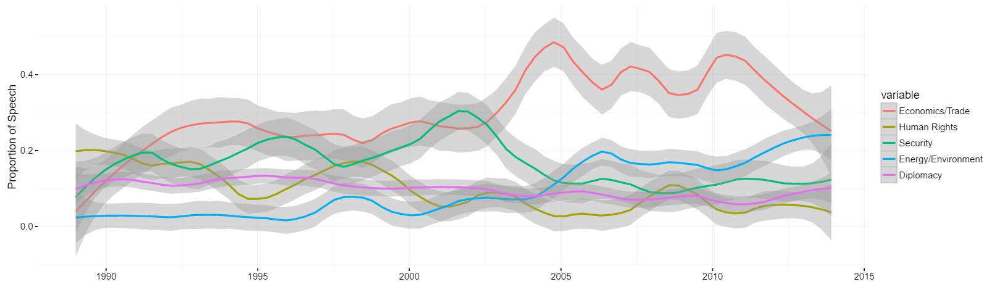

## Outline

1. Principles of "Tidy Data"
2. Data cleaning steps for one of my projects

--- .class #id 

## Data Cleaning is a Fact of Life

* Real world data is messy -- *very messy*

* 50-80% of data science work is data cleaning/data wranging/data munging ([2014 New York Times Article](http://www.nytimes.com/2014/08/18/technology/for-big-data-scientists-hurdle-to-insights-is-janitor-work.html))

* Sometimes data can be *really* messy ([An extreme example](http://rpubs.com/dgrtwo/tidying-enron))

* Embrace it: automating data cleaning can be a fun programming challenge

---

## Tidy Data

* A concept described by Hadley Wickham, [official R wizard](http://priceonomics.com/hadley-wickham-the-man-who-revolutionized-r/)

* Three simple principles:

    1. Each variable forms a column
    2. Each observation forms a row
    3. Each type of observational unit forms a table

* Getting to tidy data:

    * Resources in R: [Paper on tidy data](http://vita.had.co.nz/papers/tidy-data.pdf), [More examples](https://cran.r-project.org/web/packages/tidyr/vignettes/tidy-data.html)
    * Packages in R: tidyr, dplyr, reshape2, plyr
    * [Tidy data in python](https://www.ibm.com/developerworks/community/blogs/jfp/entry/Tidy_Data_In_Python?lang=en)

---

## Examples

* Untidy data

```{r echo = F}
trade <- read.csv(file = "data/china.csv", stringsAsFactors = F)
head(trade[1:5,1:5])

```

* (Kind of) Tidy data

```{r echo = F, message=F}
library(readxl)
library(dplyr)
library(reshape2)
library(readr)
library(stringr)
library(ggplot2)
mil_spending <- read_excel("data/spending2009.xls", skip = 3)
head(mil_spending)

```

---

## My Project

* What do U.S. politicians say about China and why?

* Use congressional speech and see what predicts negative speech about China

* Three data frames:

    -Speech-senator data frame

    -Senator-year data frame
        
    -State-year data frame


---   

## My Project 

* What do U.S. politicians say about China and why?

* Use congressional speech and see what predicts negative speech about China

* Three data frames:

    -Speech-senator data frame
        
    -~~Senator-year data frame~~
        
    -State-year data frame

---        

## Cleaning Speech Data

- Read in speech data and split file using pattern matching

```{r}
speeches <- read_file("data/109-boxer-ca.txt")
```
```
<DOC>
<DOCNO>109-boxer-ca-1-20050207</DOCNO>
<TEXT>
   Mrs. BOXER. Madam President, may I ask what is the order at the current time? 
</TEXT>
</DOC>

<DOC>
<DOCNO>109-boxer-ca-2-20050207</DOCNO>
<TEXT>
   Mrs. BOXER. Does one have to ask unanimous consent to go past the 10 minutes? 
</TEXT>
</DOC>
```

---

## Cleaning Speech Data

- Extract senator and date using regex
- Put into data frame

```{r}
speeches <- unlist(str_split(speeches, "\n*</TEXT>\n*</DOC>\n\n<DOC>\n<DOCNO>")) #stringr
speeches <- unlist(str_split(speeches, "</DOCNO>\n<TEXT>\n*"))
speeches <- matrix(speeches, nrow = length(speeches)/2, ncol = 2, byrow = T)
speeches[1,1] <- str_sub(speeches[1,1], 14, -1)
info <- unlist(str_split(speeches[,1], "-"))
info <- matrix(info, nrow = length(info)/5, ncol = 5, byrow = T)
head(info)

```


---

## Cleaning Speech Data: Other Tasks

* Matching

    - Make sure your id variables match!
    - In my case: years, state names, senator names
    - Even well-known data sets may have issues:
    
```{r echo=FALSE}
dw <- read_excel("data/dwnom_senate.xlsx", col_names = c("congress", "icpsr_id", "state_code", "district", "state", "party", "name", "first_d", "2nd_d", "error1", "error2", "corr", "ll", "votes", "errors", "geo_mean"))
```
```{r}
dw <- dw %>% select(congress, state_code, district, state, party, name, first_d) %>%
        filter(str_detect(name, "KERRY")) %>% arrange(congress)
head(dw, 10)

```


---

## Cleaning State Data: Trade Data

- Use reshape2 or tidyr to change data from "wide" to "long"
- Eliminate rows that aren't needed with dplyr

```{r message=FALSE}
head(trade[1:3,1:5])
trade <- melt(trade, id.vars = "State") #reshape2
trade <- trade %>% select(state = State, year = variable, total_exp_world = value) #dplyr
head(trade[1:3,1:3])

```


---

## Cleaning State Data: Military Spending Data

- Fix variable names and eliminate rows that aren't needed
- Each year has a different number of unnecessary rows, so difficult to automate

```{r echo = F}
head(mil_spending[1:5, 1:4])
cnames <- c("state", "payroll", "payroll_activeduty", "contracts", "grants")
colnames(mil_spending) <- cnames
```

---

## Cleaning State Data: Military Spending Data

- Fix variable names and eliminate rows that aren't needed
- Each year has a different number of unnecessary rows, so difficult to automate

```{r}
cnames <- c("state", "payroll", "payroll_activeduty", "contracts", "grants")
colnames(mil_spending) <- cnames
mil_spending <- mil_spending[c(4:11, 13:54),]
mil_spending[,2:5] <- sapply(mil_spending[,2:5], as.numeric)
head(mil_spending[1:3, 1:5])
```

---

## Cleaning State Data: Military Spending Data

- Some years were in pdf format -- used tabula to extract data but it looked like this:
```{r echo=F}
mil_messy <- read.csv(file = "data/tabula-pdf1996.csv", stringsAsFactors = F)
head(mil_messy)

```


---

## End Result

* Two datasets:
    - Speeches: 690,000+ rows
    - State-years: 1250 rows (50 states over 25 years)
    
* To work with the data:
    - Condense speech data down to senator-year (using dplyr)
    - Outer join with state data 

---

## End Result

* End up with data that can easily be graphed like this:

```{r echo = FALSE, message = FALSE, error=FALSE, fig.width = 10, fig.height = 6, warning=FALSE}
load(file = "data/model_data.RData")
ggplot(model_data, aes(y = neg_percent, x = exp_china_percent, group = party)) +
        geom_point(aes(colour = party)) + theme_bw() + ylab("Prop Negative Rhetoric") +
        xlab("Prop Exports to China") +
        theme(panel.border = element_blank(), panel.background = element_blank(), axis.title = element_text(size = 8))
```

---

## Another Cool Graph




