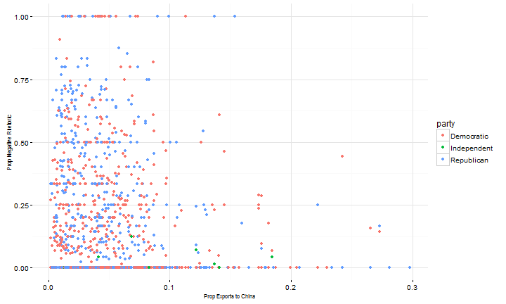
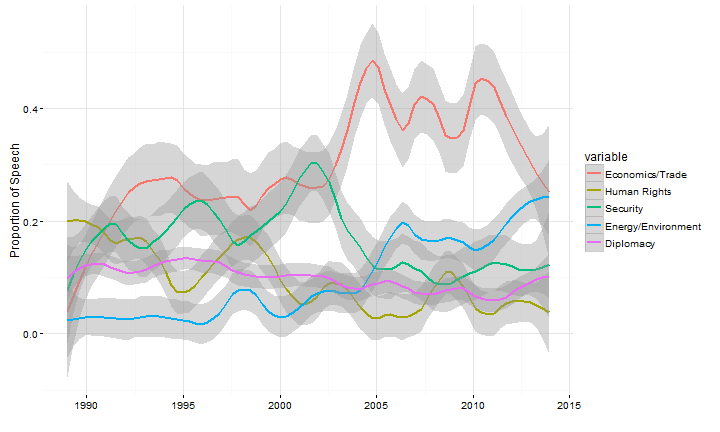

## Outline

1. Principles of "Tidy Data"
2. Data cleaning steps for one of my projects

--- .class #id 

## Data Cleaning is a Fact of Life

* Real world data is messy -- *very messy*

* 50-80% of data science work is data cleaning/data wranging/data munging ([2014 New York Times Article](http://www.nytimes.com/2014/08/18/technology/for-big-data-scientists-hurdle-to-insights-is-janitor-work.html))

* Sometimes data can be *really* messy ([An extreme example](http://rpubs.com/dgrtwo/tidying-enron))

* Embrace it: automating data cleaning can be a fun programming challenge

---

## Tidy Data

* A concept described by Hadley Wickham, [official R wizard](http://priceonomics.com/hadley-wickham-the-man-who-revolutionized-r/)

* Three simple principles:

    1. Each variable forms a column
    2. Each observation forms a row
    3. Each type of observational unit forms a table

* Getting to tidy data:

    * Resources in R: [Paper on tidy data](http://vita.had.co.nz/papers/tidy-data.pdf), [More examples](https://cran.r-project.org/web/packages/tidyr/vignettes/tidy-data.html)
    * Packages in R: tidyr, dplyr, reshape2, plyr
    * [Tidy data in python](https://www.ibm.com/developerworks/community/blogs/jfp/entry/Tidy_Data_In_Python?lang=en)

---

## Examples

* Untidy data


```
##           State       X1999       X2000       X2001       X2002
## 1 UNITED STATES 13117677381 16253029349 19234827272 22127790292
## 2    Washington  2040480542  1900659005  2928721420  3922748622
## 3    California  2394723120  3546020626  4676055993  4482780949
## 4         Texas   899734807  1452319128  1577843301  2051551556
## 5     Louisiana   663751021  1064073172   682723378   781372522
```

* (Kind of) Tidy data


```
## Source: local data frame [6 x 5]
## 
##           State          Payroll                   NA Contract awards
##           (chr)            (chr)                (chr)           (dbl)
## 1            NA            Total Active Duty Military              NA
## 2 United States 195170178.000000      84459939.000000       303355386
## 3            NA               NA                   NA              NA
## 4      Alabama    4723956.000000       1254790.000000         9501617
## 5       Alaska    2659561.000000       2077719.000000         2180004
## 6      Arizona    3137634.000000       1262572.000000        12064904
## Variables not shown: Grants (dbl)
```

---

## My Project

* What do U.S. politicians say about China and why?

* Use congressional speech and see what predicts negative speech about China

* Three data frames:

    -Speech-senator data frame

    -Senator-year data frame
        
    -State-year data frame


---   

## My Project 

* What do U.S. politicians say about China and why?

* Use congressional speech and see what predicts negative speech about China

* Three data frames:

    -Speech-senator data frame
        
    -~~Senator-year data frame~~
        
    -State-year data frame

---        

## Cleaning Speech Data

- Read in speech data and split file using pattern matching


```r
speeches <- read_file("data/109-boxer-ca.txt")
```
```
<DOC>
<DOCNO>109-boxer-ca-1-20050207</DOCNO>
<TEXT>
   Mrs. BOXER. Madam President, may I ask what is the order at the current time? 
</TEXT>
</DOC>

<DOC>
<DOCNO>109-boxer-ca-2-20050207</DOCNO>
<TEXT>
   Mrs. BOXER. Does one have to ask unanimous consent to go past the 10 minutes? 
</TEXT>
</DOC>
```

---

## Cleaning Speech Data

- Extract senator and date using regex
- Put into data frame


```r
speeches <- unlist(str_split(speeches, "\n*</TEXT>\n*</DOC>\n\n<DOC>\n<DOCNO>")) #stringr
speeches <- unlist(str_split(speeches, "</DOCNO>\n<TEXT>\n*"))
speeches <- matrix(speeches, nrow = length(speeches)/2, ncol = 2, byrow = T)
speeches[1,1] <- str_sub(speeches[1,1], 14, -1)
info <- unlist(str_split(speeches[,1], "-"))
info <- matrix(info, nrow = length(info)/5, ncol = 5, byrow = T)
head(info)
```

```
##      [,1]  [,2]    [,3] [,4] [,5]      
## [1,] "109" "boxer" "ca" "1"  "20050207"
## [2,] "109" "boxer" "ca" "2"  "20050207"
## [3,] "109" "boxer" "ca" "3"  "20050207"
## [4,] "109" "boxer" "ca" "1"  "20060309"
## [5,] "109" "boxer" "ca" "2"  "20060309"
## [6,] "109" "boxer" "ca" "3"  "20060309"
```


---

## Cleaning Speech Data: Other Tasks

* Matching

    - Make sure your id variables match!
    - In my case: years, state names, senator names
    - Even well-known data sets may have issues:
    


```r
dw <- dw %>% select(congress, state_code, district, state, party, name, first_d) %>%
        filter(str_detect(name, "KERRY")) %>% arrange(congress)
head(dw, 10)
```

```
## Source: local data frame [10 x 7]
## 
##    congress state_code district   state party        name first_d
##       (dbl)      (dbl)    (dbl)   (chr) (dbl)       (chr)   (dbl)
## 1        99          3        0 MASSACH   100    KERRY  J  -0.372
## 2       100          3        0 MASSACH   100    KERRY  J  -0.373
## 3       101          3        0 MASSACH   100  KERRY JOHN  -0.375
## 4       102          3        0 MASSACH   100 KERRY  JOHN  -0.376
## 5       103          3        0 MASSACH   100 KERRY  JOHN  -0.378
## 6       104          3        0 MASSACH   100 KERRY  JOHN  -0.379
## 7       105          3        0 MASSACH   100 KERRY  JOHN  -0.381
## 8       106          3        0 MASSACH   100 KERRY  JOHN  -0.382
## 9       107          3        0 MASSACH   100 KERRY  JOHN  -0.384
## 10      108          3        0 MASSACH   100 KERRY  JOHN  -0.385
```


---

## Cleaning State Data: Trade Data

- Use reshape2 or tidyr to change data from "wide" to "long"
- Eliminate rows that aren't needed with dplyr


```r
head(trade[1:3,1:5])
```

```
##           State       X1999       X2000       X2001       X2002
## 1 UNITED STATES 13117677381 16253029349 19234827272 22127790292
## 2    Washington  2040480542  1900659005  2928721420  3922748622
## 3    California  2394723120  3546020626  4676055993  4482780949
```

```r
trade <- melt(trade, id.vars = "State") #reshape2
trade <- trade %>% select(state = State, year = variable, total_exp_world = value) #dplyr
head(trade[1:3,1:3])
```

```
##           state  year total_exp_world
## 1 UNITED STATES X1999     13117677381
## 2    Washington X1999      2040480542
## 3    California X1999      2394723120
```


---

## Cleaning State Data: Military Spending Data

- Fix variable names and eliminate rows that aren't needed
- Each year has a different number of unnecessary rows, so difficult to automate


```
## Source: local data frame [5 x 4]
## 
##           State          Payroll                   NA Contract awards
##           (chr)            (chr)                (chr)           (dbl)
## 1            NA            Total Active Duty Military              NA
## 2 United States 195170178.000000      84459939.000000       303355386
## 3            NA               NA                   NA              NA
## 4      Alabama    4723956.000000       1254790.000000         9501617
## 5       Alaska    2659561.000000       2077719.000000         2180004
```

---

## Cleaning State Data: Military Spending Data

- Fix variable names and eliminate rows that aren't needed
- Each year has a different number of unnecessary rows, so difficult to automate


```r
cnames <- c("state", "payroll", "payroll_activeduty", "contracts", "grants")
colnames(mil_spending) <- cnames
mil_spending <- mil_spending[c(4:11, 13:54),]
mil_spending[,2:5] <- sapply(mil_spending[,2:5], as.numeric)
head(mil_spending[1:3, 1:5])
```

```
## Source: local data frame [3 x 5]
## 
##      state payroll payroll_activeduty contracts grants
##      (chr)   (dbl)              (dbl)     (dbl)  (dbl)
## 1 Alabama  4723956            1254790   9501617  66056
## 2  Alaska  2659561            2077719   2180004  48783
## 3 Arizona  3137634            1262572  12064904 105948
```

---

## Cleaning State Data: Military Spending Data

- Some years were in pdf format -- used tabula to extract data but it looked like this:

```
##                 X     Contract          X.1                     PERSONNEL
## 1          STATE     awards 1      Payroll                 (1,000) STATE 
## 2                 (mil. dol.)  (mil. dol.)              CivilianMilitary 
## 3       U.S. . .      109,408       99,794  732.0 1,056.1 MO . . . . . . 
## 4 AL . . . . . .        1,838        2,183      22.0 14.6 MT . . . . . . 
## 5 AK . . . . . .          565          879       4.4 16.6 NE . . . . . . 
## 6 AZ . . . . . .        2,911        1,865       8.8 21.8 NV . . . . . . 
##     Contract.1         X.2 X.3       PERSONNEL.1
## 1    awards 1     Payroll   NA           (1,000)
## 2 (mil. dol.)  (mil. dol.)  NA Civilian Military
## 3       7,093       1,630   NA         15.8 14.6
## 4          91         298   NA           1.1 3.7
## 5         322         711   NA           3.7 9.4
## 6         285         777   NA           2.2 7.8
```


---

## End Result

* Two datasets:
    - Speeches: 690,000+ rows
    - State-years: 1250 rows (50 states over 25 years)
    
* To work with the data:
    - Condense speech data down to senator-year (using dplyr)
    - Outer join with state data 

---

## End Result

* End up with data that can easily be graphed like this:



---

## Another Cool Graph




